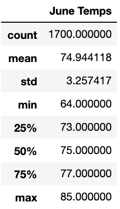
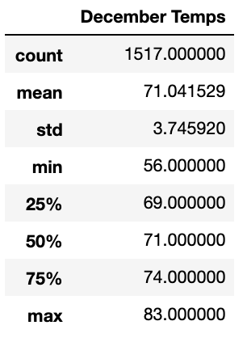

# surfs_up challenge 

## Overview

The purpose of this analysis was to help W. Avy determine if opening a surf and ice cream shop business would be sustainable year-round in Hawaii. To do this, we dug deeper to find more information about temperature trends before opening his surf shop. We looked at specific temperature data for the months of June and December in Oahu, Hawaii. I all goes well, W. Avy would like to explore the possibility of expanding to other islands.

## Results

- I used Python, Pandas functions and methods, and SQLAlchemy, and filtered the date column of the Measurements table in the hawaii.sqlite database to retrieve all the temperatures for the month of June. I then convert those temperatures to a list, created a DataFrame from the list, and generated the summary statistics.

  - The image below shows the summary statistcs which was generated by using the `.describe()` function:
        - 
 
 - I used Python, Pandas functions and methods, and SQLAlchemy, and filtered the date column of the Measurements table in the hawaii.sqlite database to retrieve all the temperatures for the month of December. I then convert those temperatures to a list, created a DataFrame from the list, and generated the summary statistics.

  - The image below shows the summary statistcs which was generated by using the `.describe()` function:
        - 

- The three key differences between the temperature anaylyses between June and December is that there was far more data available for June than December as the count is 1700 and 1517 respectively. The low standard deviation in June means data are clustered around the mean, and the slightly higher standard deviation in December indicates data are more spread out. The temperature in December is slightly cooler than in June. We can conclude that 75% of the time the temperatures are 77F in June and 74F in December. 

## Summary

In summary, we can conclude that there isn't much difference between the weather temperatures in June and December. Granted that it is slightly cooler in December, the analysis confirms that it would be a great idea for W. Avy to open his surf and ice cream shop on Oahu. If his business takes off, he can expand to other islands.

A few other queries that I would consider would:
* Accounting for any natural disasters such as earthquakes, tsunamis, flash floods and hurricanes as this could negatively impact his business.
* For his surf shop, I would like to analyze what month and time of day would be best to catch the biggest waves for surfing on the North Shore. This way he can advertise big wave surfing for his surf shop and this would help grow his business. 

 
